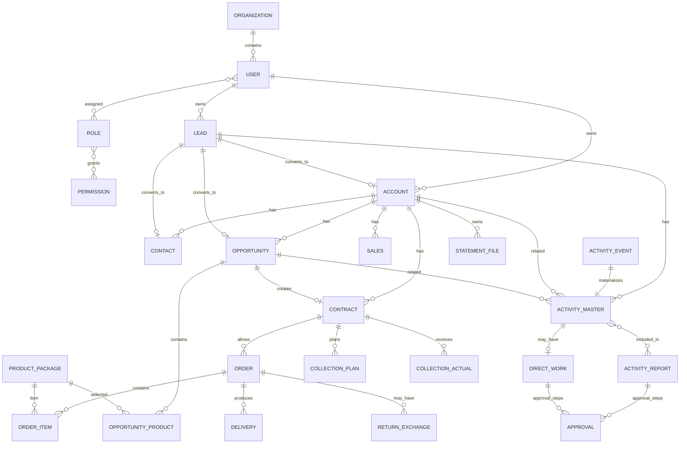

# P0-03 ERD 초안

> 논리 ERD. 실제 물리 테이블명, PK 타입, 정규화 수준은 Phase 1 DB 설계에서 확정한다.

## 1. Core Logical ERD



## 2. Lead Convert 모델

Lead Convert는 단순 Update가 아니라 다음 생성/연결 작업을 하나의 업무 Transaction으로 취급한다.

```text
Lead
 ├─→ Account
 ├─→ Contact (0..N)
 └─→ Opportunity
       ↑
기존 Lead Activity ── 관계 재연결 또는 변환추적
```

권장 변환이력:
- source_lead_id
- target_account_id
- target_contact_id
- target_opportunity_id
- converted_at / converted_by

Activity 이관 방식은 `related_type/related_id` 변경 또는 별도 Link History 두 방식이 가능하며 Phase 1에서 선택한다.

## 3. Activity 모델 분리 이유

교육자료상 Event는 캘린더 확인용이고 활동내역은 승인/보고용 Activity Master다.

```text
ActivityEvent (Schedule)
     1:1
ActivityMaster (Execution/Report Master)
     ├─ ActivityReport
     └─ DirectWork
```

## 4. Contract / Collection 모델

```text
Opportunity (Won)
   ↓ 1회
Contract
   ├─ CollectionPlan 1..N
   ├─ CollectionActual 0..N (ERP)
   └─ Order 0..N
```

수금계획은 최초값과 변경값을 단순 덮어쓰기하지 않고 최초계획/분할/미수재할당/ERP 전송이력을 추적 가능하게 설계한다.

## 5. Integration 모델

업무 Entity 자체의 `integration_status`와 별도로 `InterfaceLog`를 둔다.

```text
Business Entity
  ├─ integration_status = 현재 대표상태
  └─ InterfaceLog 1..N = 요청/응답/재시도 상세이력
```

## 6. 물리설계 전 확정 필요

- PK: bigint identity vs UUID
- Soft Delete 정책
- Multi-company / 법인 구분키
- 조직/사용자 Master 원천
- Product/Package Master 동기화 방식
- Lead Convert Activity 이관 구현방식
- 수금계획 변경이력 저장방식
- Interface payload 보관기간/민감정보 마스킹
